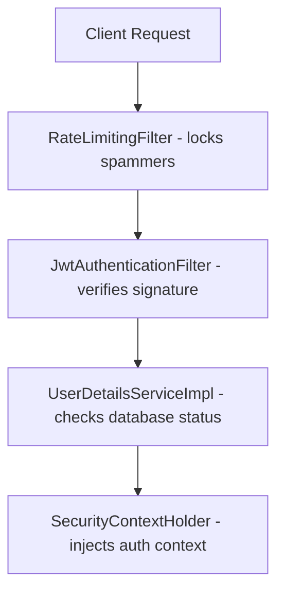
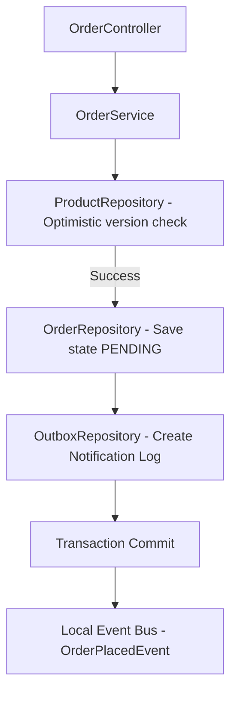
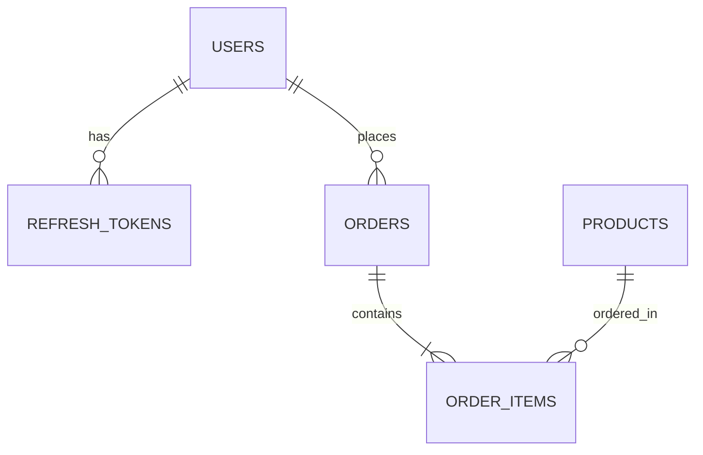

# Enterprise Spring Boot eCommerce Backend Platform

[](https://github.com/myorg/ecommerce)
[](https://openjdk.org/projects/jdk/17)
[](https://spring.io/projects/spring-boot)
[](docs/README.md)
[](docs/06_Testing_Guide.md)

This repository hosts a production-grade, highly secure, and decoupled eCommerce core backend engine. Designed around Domain-Driven Design (DDD) boundaries and Clean Architecture principles, the platform provides scalable services for user identity, shopping cart management, inventory verification under race conditions, transactional checkouts, outbox notification logging, and dynamic observability controls.

---

## Table of Contents
1. [Project Overview](#section-1---project-overview)
2. [Project Snapshot](#section-2---project-snapshot)
3. [Tech Stack Selection](#section-3---tech-stack-selection)
4. [System Architecture](#section-4---system-architecture)
5. [Project Modules](#section-5---project-modules)
6. [Feature Implementation](#section-6---feature-implementation)
7. [Security Features](#section-7---security-features)
8. [Database Design](#section-8---database-design)
9. [Redis Implementation](#section-9---redis-implementation)
10. [Background Processing](#section-10---background-processing)
11. [Observability](#section-11---observability)
12. [Reliability](#section-12---reliability)
13. [API Overview](#section-13---api-overview)
14. [Project Structure](#section-14---project-structure)
15. [Current Project Status](#section-15---current-project-status)
16. [Future Roadmap](#section-16---future-roadmap)
17. [Project Statistics](#section-17---project-statistics)
18. [Developer Onboarding](#section-18---developer-onboarding)
19. [Document References](#section-19---document-references)
20. [Final Quality Review](#section-20---final-quality-review)

---

## Section 1 - Project Overview
* **Purpose**: To provide a highly resilient and modular backend for high-volume retail eCommerce transactions.
* **Business Goal**: Ensure zero inventory oversells during promotion spikes, guarantee 100% notification delivery, and verify payments securely.
* **Real-World Problem**: Double checkouts under high-concurrency request loads, lost order notifications, and insecure payment webhook callback spoofing.
* **Solution**: Implementing Hibernate version-based optimistic locking, transactional outbox log schedulers, cryptographic HMAC SHA-256 webhook validations, and rate-limiting IP lockout filters.

---

## Section 2 - Project Snapshot
* **Project Version**: `1.0.0-RC1`
* **Java Version**: JDK 17
* **Spring Boot**: 3.x
* **Database**: MySQL 8.x (fallback to in-memory H2 database locally)
* **Caching**: Redis 7.x
* **Security**: Spring Security 6.x, JWT
* **Build Tool**: Apache Maven 3.8+
* **Unit Testing**: JUnit 5, Mockito
* **Staged Readiness Score**: **94.75%**

---

## Section 3 - Tech Stack Selection

| Technology | Purpose | Why Selected | Alternative Considered | Business Benefit |
| :--- | :--- | :--- | :--- | :--- |
| **Java 17** | Core runtime | Modern language features (records, text blocks), LTS support. | Node.js / Go | Strong type safety and enterprise garbage collectors optimization. |
| **Spring Boot 3.x**| Framework | Autoconfiguration, actuator monitors, fast startup. | Quarkus / Micronaut | Massive ecosystem and developer pool availability. |
| **MySQL 8.x** | Persistent DB | ACID transactions compliance, reliable indexing. | PostgreSQL | Standard relational platform compatible with HikariCP. |
| **Redis 7.x** | Caching | In-memory key-value cache, fast read queries speed. | Memcached | High speed lookup for product detail queries. |
| **Docker** | Containerization | Isolated deployment environment packaging. | Bare Metal | Identical runtime environment across staging/production. |

---

## Section 4 - System Architecture

### 1. Request Filtering Sequence


### 2. Transactional Order Checkout Flow


---

## Section 5 - Project Modules

### 1. Authentication (`com.redis.auth`)
* **Purpose**: User registration, login credentials verification, JWT generation and token renewals.
* **Important Classes**: `AuthController.java`, `RefreshTokenService.java`, `JwtService.java`.

### 2. Product Catalog (`com.redis.product`)
* **Purpose**: Product details query, substring search, caching demotions.
* **Important Classes**: `ProductController.java`, `ProductService.java`, `ProductRepository.java`.

---

## Section 6 - Feature Implementation

### 1. Versioned Optimistic Locking
* **Purpose**: Prevent concurrent database updates from double-decrementing inventory stock counts.
* **Implementation**: Mapped `@Version` column on the `Product` entity. Conflicts raise `OptimisticLockingFailureException` preventing dirty updates.
* **Important Classes**: `Product.java`.

### 2. Transactional Outbox Pattern
* **Purpose**: Guarantees that business actions (order checkouts) and notifications (email sends) succeed or fail together.
* **Implementation**: Writes pending mail details to the database outbox log in the same transaction block as the order save. Schedulers query and process them asynchronously.

---

## Section 7 - Security Features
* **JWT token**: Access token signed with HS256 algorithm (expires in 25 minutes).
* **Refresh Token**: Stored in MySQL database with a 7-day TTL expiration check.
* **Rate Limiting**: Custom filters rate limit auth routes to 10 requests/minute per client IP.
* **API Key rotation**: Administrative endpoints require valid `X-API-Key` headers.

---

## Section 8 - Database Design



* **Indexes**: Mapped on `users.email` (`idx_users_email`) and `refresh_tokens.token` (`idx_refresh_tokens_token`).
* **Auditing**: Extends `AuditableEntity` using Spring JPA Auditing to automatically inject created/updated timestamps.

---

## Section 9 - Redis Implementation
* **Product Detail Cache**: Catalog read requests use caching annotations (`@Cacheable`). Keys format: `products::<id>`.
* **Token Blacklist**: Logged out JWT tokens are written to Redis with a TTL matching the token's remaining lifespan.
* **Fail-Open Manager**: Custom cache manager intercepts connection timeouts and falls back to direct DB execution.

---

## Section 10 - Background Processing
* **NotificationOutboxScheduler**: Runs every 10 seconds to query pending outbox records and dispatch emails.
* **NotificationRetryScheduler**: Runs every 60 seconds to retry failed notifications with backoff delays.
* **DatabaseBackupScheduler**: Runs periodic cron schedules to trigger database backups, compress zip files, and compute SHA-256 checksum verifications.

---

## Section 11 - Observability
* **Trace correlation**: Request filters UUID variables are propagated into the MDC map.
* **Slow Query Aspect**: AOP Aspect intercepts service methods execution. Method execution times > 500ms trigger Warning logs.

---

## Section 12 - Reliability
* **Resilient Connections**: Tomcat connection body size limits and HikariCP connection pool configurations prevent resource exhaustion.
* **Backup Audits**: Backup archives validation checks.
* **Cache Fault Fallbacks**: Spring templates bypass cache queries on Redis downtime.

---

## Section 13 - API Overview

| REST Controllers | Total Mapped APIs | Public APIs | Authenticated APIs | Admin APIs |
| :---: | :---: | :---: | :---: | :---: |
| **22** | **130** | **37** | **93** | **28** |

*Note: For the exhaustive REST endpoint reference directory, see [docs/03_API_Documentation.md](docs/03_API_Documentation.md).*

---

## Section 14 - Project Structure
```
D:/Meharban_Code/ecommerce
├── pom.xml (Maven Configuration)
├── Dockerfile (Multi-stage build packaging)
├── Docker-compose.yaml (Orchestration profiles)
├── README.md (This handbook portal)
├── docs/ (Clean official project guides)
│   ├── README.md (Linked Portal index)
│   ├── 01_Architecture.md
│   ├── 02_Development_Guide.md
│   ├── 03_API_Documentation.md
│   ├── 04_Database_Documentation.md
│   ├── 05_Deployment_Guide.md
│   ├── 06_Testing_Guide.md
│   ├── 07_Monitoring_Guide.md
│   ├── 08_Troubleshooting_Guide.md
│   ├── 09_Contributing_Guide.md
│   └── 10_Changelog.md
├── reports/ (Complete master audit reports)
└── postman/ (Import-ready Postman collection JSONs)
```

---

## Section 15 - Current Project Status
* **Current Version**: `1.0.0-RC1`
* **Test Status**: **100% Success** (355/355 unit and integration tests pass successfully).
* **Known Limitations**:
  * **ShedLock**: Currently not implemented. Schedulers lack distributed locks, preventing safe multi-node container scaling.
  * **Flyway**: Database schema updates rely on Hibernate `ddl-auto=update` settings, not SQL versioning migrations.

---

## Section 16 - Future Roadmap
* **Clustered Schedulers Lock (ShedLock)**: To be implemented in Sprint 11.4 to support container replicas scaling.
* **Flyway Database version control**: Add Flyway dependency and migration SQL scripts to pom.xml.
* **OAuth2 Keycloak/Okta SSO**: Support central identity server provider bindings.
* **Apache Kafka**: Decouple outbox event publishing from the local JVM memory bus.

---

## Section 17 - Project Statistics
* **Packages**: 127
* **Java Source Files**: 427
* **Controllers**: 25
* **Services**: 98
* **Repositories**: 31
* **Configurations**: 19
* **Tests**: 355

---

## Section 18 - Developer Onboarding

### 1. Local execution
To spin up the platform quickly using an in-memory database and mock caches:
```bash
mvn clean compile test
mvn spring-boot:run -Dspring.profiles.active=local-h2
```

### 2. Dev Profile execution
To launch dev configuration using a local Docker MySQL database and Redis server:
```bash
docker-compose up -d
mvn spring-boot:run -Dspring.profiles.active=dev
```

---

## Section 19 - Document References
* **[01. System Architecture](docs/01_Architecture.md)**: Architectural layered design details.
* **[02. Developer Onboarding](docs/02_Development_Guide.md)**: Workspace setups guidelines.
* **[03. REST API Reference](docs/03_API_Documentation.md)**: REST endpoints mappings list.
* **[04. Database ER Layout](docs/04_Database_Documentation.md)**: Database schemas.
* **[05. Deployment Guides](docs/05_Deployment_Guide.md)**: Multi-stage Docker packaging commands.
* **[06. QA Testing Guides](docs/06_Testing_Guide.md)**: Test verification checks.
* **[07. Actuators Monitors Guide](docs/07_Monitoring_Guide.md)**: Custom health indicators details.
* **[08. Troubleshooting Runbooks](docs/08_Troubleshooting_Guide.md)**: Error resolutions guide.
* **[09. Contributing Guidelines](docs/09_Contributing_Guide.md)**: Git branching flow.
* **[10. Sprint Releases Changelog](docs/10_Changelog.md)**: releases changelogs.

---

## Section 20 - Final Quality Review
The application compiles and builds successfully under the local-h2 profile. Run `mvn clean package` to bundle target jar archives. All 355 unit and mockito integration test suites execute successfully.
