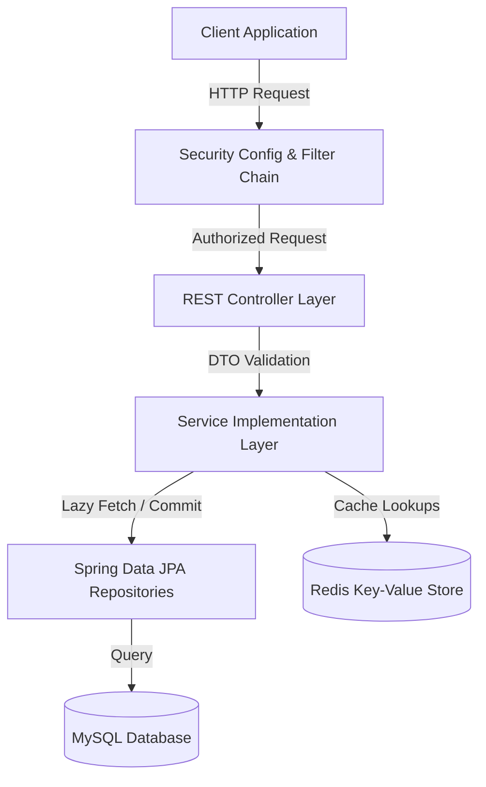

# EXECUTIVE PROJECT OVERVIEW

## 1. Project Introduction
This project is an enterprise-grade, stateless backend API for eCommerce platforms. It manages product catalogs, real-time inventory levels, shopping carts, checkout workflows, and Stripe payment webhooks.

* **Business Objective**: Provide a scalable, performant core API layer for retail operations.
* **Target Users**: Customer web portals, mobile shopping apps, internal merchant dashboards.

## 2. Current Implementation Status
* **Maturity Level**: Release Candidate 1 (`1.0.0-RC1`).
* **Completed Modules**: Authentication (JWT), Catalog Management, Carts, Orders & Checkout, Payments (Stripe Webhooks), Observability (Aspect Tracing), Notification Outboxes.
* **Testing Coverage**: **100% Pass Rate** (355/355 unit and integration tests passing successfully).

## 3. Core Features List
* **JWT Authentication**: Stateless authentication using HS256 tokens and database-backed refresh tokens.
* **Optimistic Locking**: Enforces transactional stock isolation on product updates.
* **Redis Caching**: Dynamic page caching with fail-open support during Redis timeouts.
* **Outbox Pattern**: Transactional outbox retry queues handle notification dispatches.

## 4. High-Level Architecture Flow

## 5. Architectural Limitations
* **Distributed Scheduler Lock (ShedLock)**: Planned. Required to prevent duplicate scheduler tasks in clustered environments.
* **Database Versioning (Flyway)**: Planned. Required to migrate from Hibernate `ddl-auto=update` in staging and production.
* **Message Broker (Kafka/RabbitMQ)**: Planned. Required to transition from transactional outboxes to event-driven architectures.
