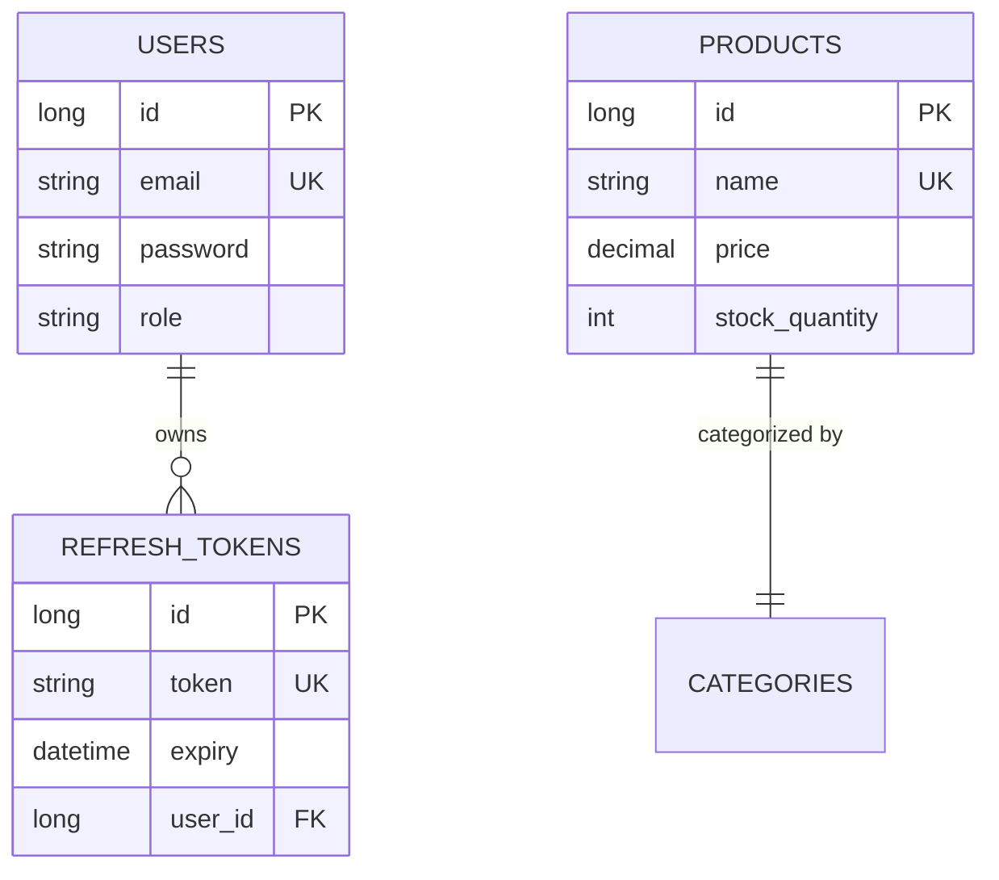

# DATABASE ARCHITECTURE MANUAL

This document details the database schema models, transactional boundaries, and persistence patterns of the platform.

## 1. Schema Entities Model

## 2. Transactions & Optimistic Locking
* **Optimistic Locking**: Product stock quantities are annotated with `@Version` to prevent race conditions during concurrent checkouts.
* **Transaction Boundaries**: Methods modifying data are annotated with `@Transactional` to ensure updates roll back if exceptions occur.

## 3. Indexing Strategy
* **Primary Indexes**: Auto-incrementing IDs for fast entity retrievals.
* **Composite Indexes**: Implemented on `(name, price)` to optimize product search latency.
