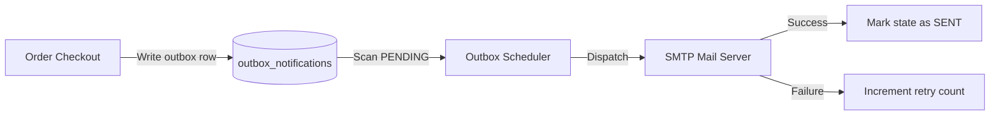

# TRANSACTIONAL NOTIFICATION OUTBOX

This document details the transactional outbox pattern used to ensure eventual consistency for notifications.

## 1. Notification Event Flow

## 2. Scheduler Configuration
* **Execution Interval**: Schedulers run every 10 seconds.
* **Retry Protocol**: Schedulers attempt delivery up to 5 times. If failures persist, the record state is updated to `DEAD_LETTER`.
