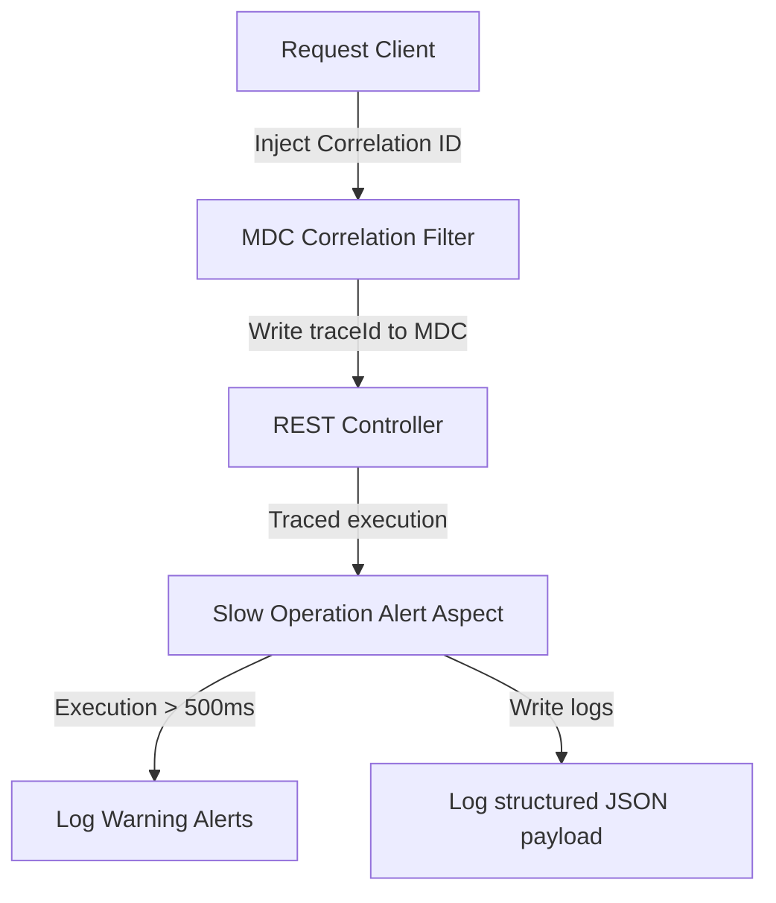

# OBSERVABILITY & ASPECT TRACING

This document details request tracing, MDC logs, and execution performance tracking.

## 1. Tracing Lifecycle Flow



## 2. Structured JSON Logging Layout
The system logs events as structured JSON payloads to simplify parsing:
```json
{
  "timestamp": "2026-07-13T09:12:06Z",
  "level": "INFO",
  "traceId": "ada3d526-a875-...",
  "endpoint": "/api/orders",
  "durationMs": 14
}
```
* **MDC Interception**: Extracted correlation IDs are automatically added to all application logs within the thread context.
