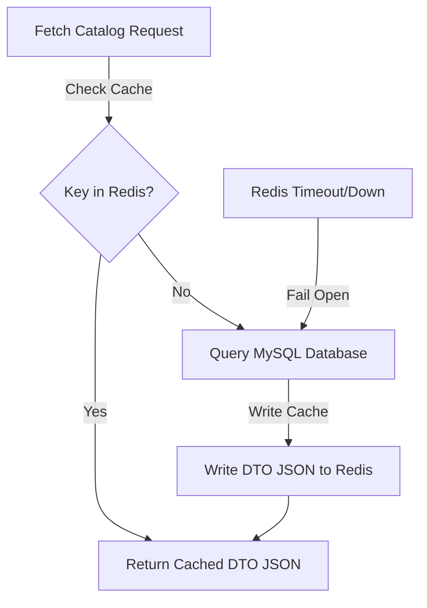

# REDIS CACHING TOPOLOGY

This document details the caching strategy, eviction policies, and timeout fallback mechanisms of the platform.

## 1. Caching Flow Topology

## 2. Eviction & TTL Policies
* **Product Details Cache**: Expiration is configured with a 30-minute Time-To-Live (TTL).
* **Eviction Triggers**: Modifications to products evict related caches to maintain consistency.

## 3. Downtime Resiliency (Fail-Open)
A custom cache error handler catches connection timeouts, allowing the application to query the database directly during Redis outages.
