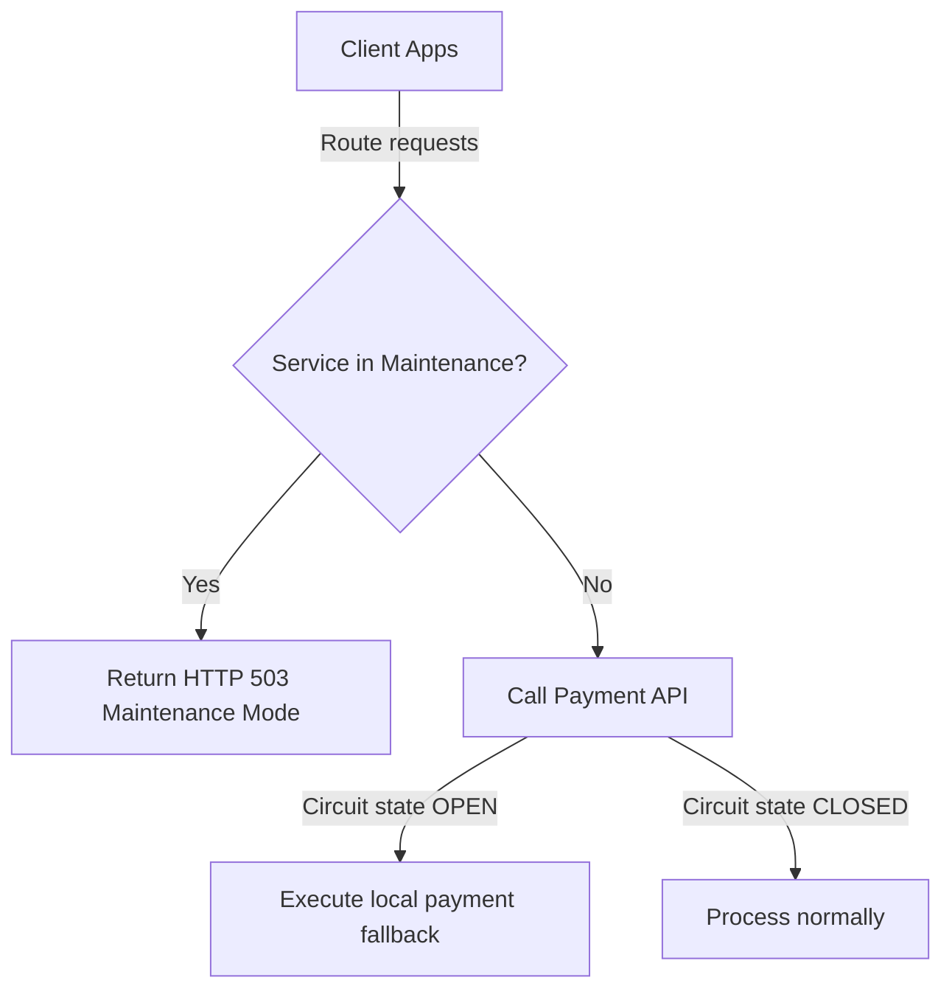

# SYSTEM RELIABILITY & FAULT TOLERANCE

This document details feature flags, circuit breakers, and container readiness controls.

## 1. Reliability Systems Flow

## 2. Circuit Breakers
Wraps external API integrations (e.g., payment gateways) to fail fast and trigger fallback services during outages.

## 3. Maintenance Mode Filter
A custom security filter intercepts incoming traffic and returns `503 Service Unavailable` when maintenance mode is active.

## 4. Graceful Tomcat Shutdown
Tomcat is configured to wait 15 seconds for active transactions to complete before shutting down during container redeployments.
