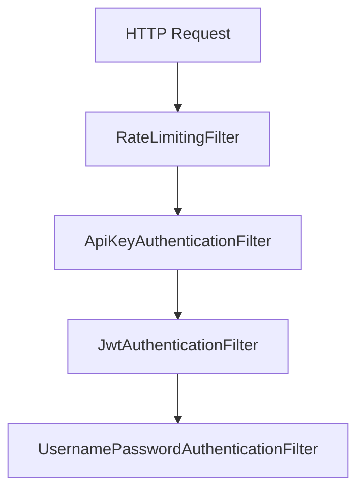
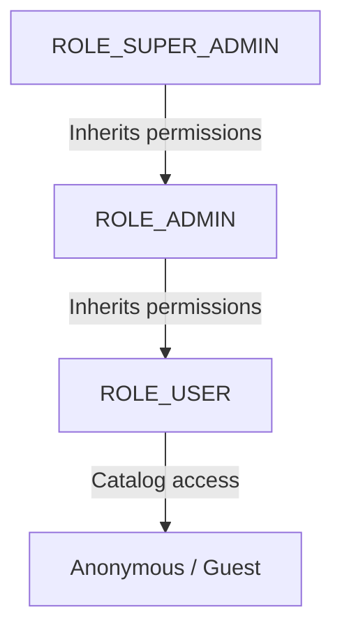

# SECURITY ARCHITECTURE MANUAL

This document details the authentication and authorization controls implemented in the system.

## 1. Security Filter Chain Flow

## 2. JWT Lifecycle & Signature Verification
* **HS256 Encryption**: Access tokens are signed using a 256-bit secret key resolved from environment properties.
* **Token Blacklisting**: Logged-out tokens are stored in Redis with a TTL matching their remaining validity to prevent replay attacks.

## 3. Role-Based Access Control Flow

## 4. API Key Verification
Integrations utilize an `X-API-Key` header validated against hashed credentials stored in the database.

---

## 5. Rate Limiting
A custom filter limits requests per IP address using Redis atomic counters to prevent resource exhaustion.
