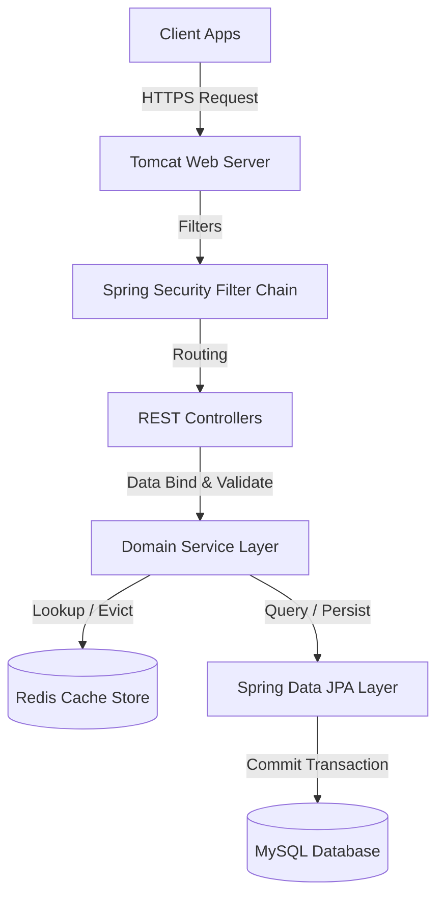
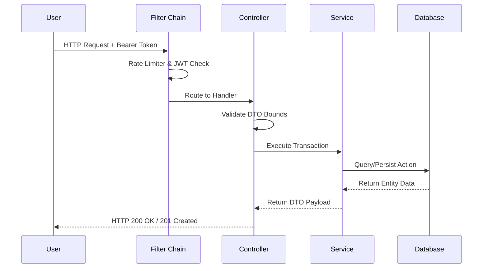

# SYSTEM ARCHITECTURE GUIDE

This document details the layer boundaries, execution pipelines, and runtime request lifecycles of the application.

## 1. High-Level Subsystems Flow

## 2. Layer Responsibilities

### Controller Layer
Handles HTTP requests, deserializes JSON request bodies into DTO objects, validates request parameters, and handles exceptions via global advisors.

### Service Layer
Contains core business logic, orchestrates data validation, manages database transactions, and manages the caching lifecycle.

### Repository Layer
Extends Spring Data JPA interfaces to execute database queries. No business logic is permitted at this level.

---

## 3. Request Lifecycle

