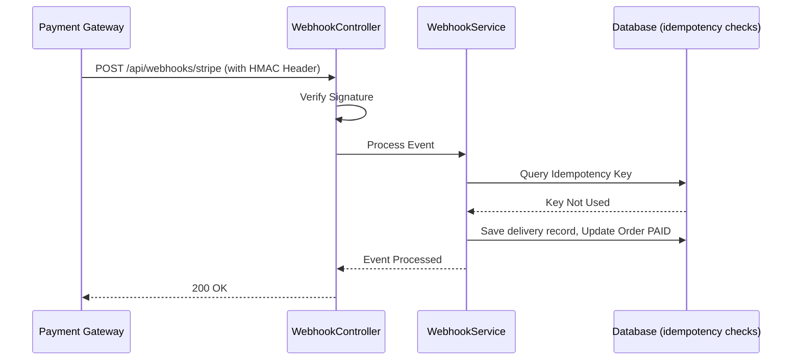

# WEBHOOK LIFECYCLE & INTEGRATIONS

This document details the webhook subsystem, signature verification, and delivery workflow.

## 1. Webhook Processing Flow

## 2. Security & Idempotency
* **Signature Verification**: Validates HMAC signature headers using secrets to confirm request authenticity.
* **Idempotency**: Webhook events are logged in the database using their unique IDs to prevent duplicate processing.
