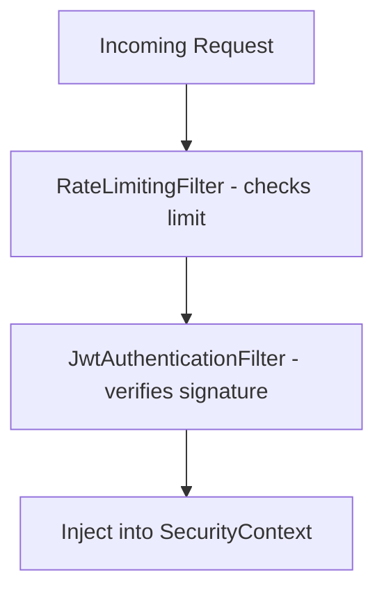
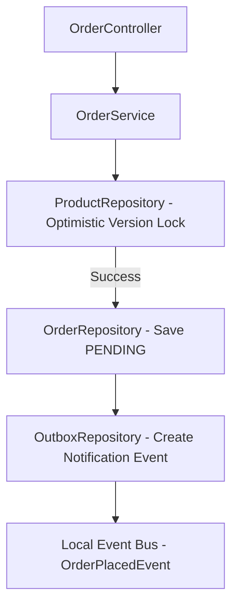

# 01. System Architecture

This document outlines the architectural paradigms and transactional flows.

## 1. Architectural Layers
The backend is structured into domain modular packages (`product`, `auth`, `cart`, `order`, etc.). The dependencies flow strictly downstream:
```
RestControllers (REST Bindings)
      ↓
Domain Services (Business Logic)
      ↓
JPA Repositories (Data Access)
```
No repository classes are directly accessed in controllers.

## 2. Sequence Flows

### Security & Rate Limiting Filters


### Order Placement Flow

