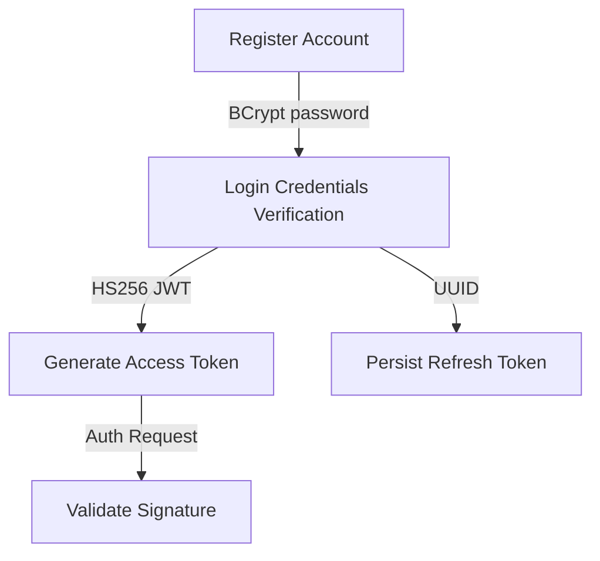

# AUTHENTICATION & IDENTITY MODULE

## 1. Module Overview
* **Purpose**: Coordinates user onboarding, secure password verification, and session authentication.
* **Business Objective**: Protect customer profiles and secure payment and checkout workflows.
* **Responsibilities**: Handles user registration, credentials verification, password hashing, and token renewals.

## 2. Business Flow

## 3. Internal Architecture
* **Controller**: `AuthController.java` (routes: `/api/auth/register`, `/api/auth/login`, `/api/auth/refresh`, `/api/auth/logout`)
* **Service**: `AuthServiceImpl.java` (coordinates password verification and generates tokens)
* **Repository**: `UserRepository.java`, `RefreshTokenRepository.java`
* **Entities**: `User.java`, `RefreshToken.java`

## 4. Important Components
* **BCryptPasswordEncoder**: Encrypts user passwords during registration.
* **JwtTokenProvider**: Generates HS256 JWT access tokens and validates signatures on incoming requests.

## 5. Security & Validation
* **Security**: Enforces password requirements (minimum 8 characters, mixed case, numbers, and special symbols) and limits login attempts using rate limits.
* **Exceptions**: Returns `401 Unauthorized` for invalid credentials and `409 Conflict` for duplicate emails.
* **Audit Logs**: Logs successful logins and token rotations for compliance.
