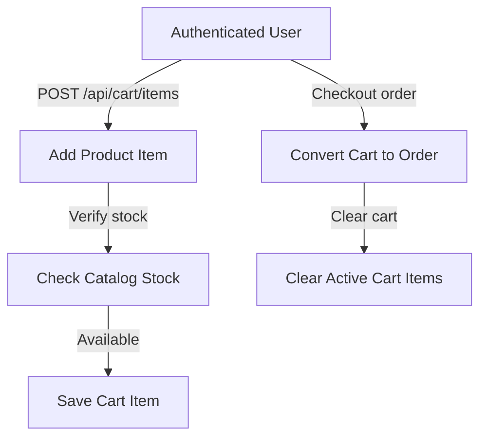

# SHOPPING CART SUBSYSTEM

## 1. Module Overview
* **Purpose**: Manages active shopping cart items for authenticated users.
* **Business Objective**: Enable customers to collect and modify items before checkout.
* **Responsibilities**: Adds items to cart, updates quantities, and calculates totals.

## 2. Business Flow

## 3. Internal Architecture
* **Controller**: `CartController.java`
* **Service**: `CartServiceImpl.java`
* **Repository**: `CartItemRepository.java`
* **Entities**: `CartItem.java`

## 4. Important Components
* **CartServiceImpl**: Manages adding, updating, and removing items, and validates requested quantities against available catalog stock.

## 5. Security & Validation
* **Security**: Restricts operations to authenticated users (`ROLE_USER`). Users can only access their own cart items.
* **Validation**: Restricts requested quantities to positive integers.
* **Exceptions**: Returns `400 Bad Request` if requested quantities exceed available catalog stock.
