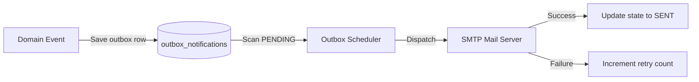

# TRANSACTIONAL NOTIFICATION MODULE

## 1. Module Overview
* **Purpose**: Manages asynchronous notification dispatches.
* **Business Objective**: Inform customers of order status updates without blocking primary API response threads.
* **Responsibilities**: Logs notification events to the outbox table and dispatches emails via SMTP.

## 2. Business Flow

## 3. Internal Architecture
* **Controller**: None (Exposes no public REST endpoints)
* **Service**: `NotificationServiceImpl.java`
* **Scheduler**: `NotificationOutboxScheduler.java`
* **Repository**: `NotificationOutboxRepository.java`
* **Entities**: `NotificationOutbox.java`

## 4. Important Components
* **NotificationOutboxScheduler**: Scans the outbox table for `PENDING` states every 10 seconds and dispatches emails using JavaMailSender.

## 5. Security & Validation
* **Security**: System actions execute within internal security scopes.
* **Retry Limits**: Schedulers attempt delivery up to 5 times. If failures persist, the record state is updated to `DEAD_LETTER` for manual review.
