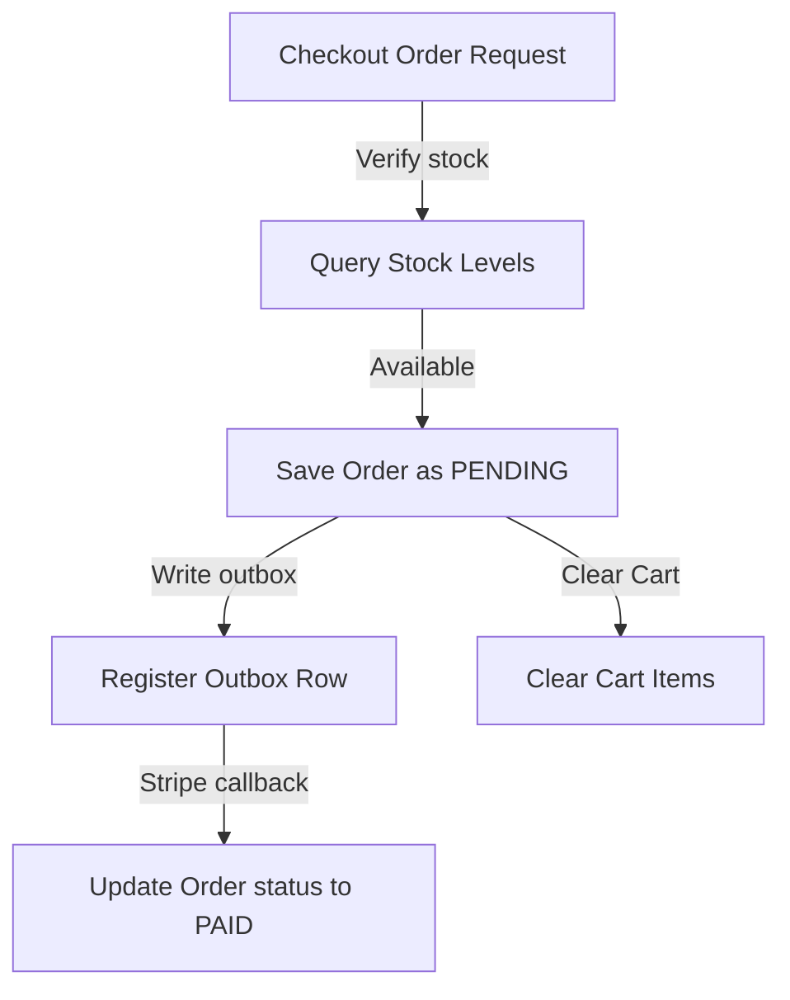

# CHECKOUT & ORDER PROCESSING MODULE

## 1. Module Overview
* **Purpose**: Manages checkout processing, order placement, and order state transitions.
* **Business Objective**: Complete product purchases, reserve stock, and log transaction details.
* **Responsibilities**: Processes checkouts, manages order states, and handles transactional rollbacks.

## 2. Business Flow

## 3. Internal Architecture
* **Controller**: `OrderController.java`
* **Service**: `OrderServiceImpl.java`
* **Repository**: `OrderRepository.java`, `OrderItemRepository.java`
* **Entities**: `Order.java`, `OrderItem.java`

## 4. Important Components
* **OrderServiceImpl**: Coordinates order creation and stock checks inside `@Transactional` blocks to ensure updates roll back if errors occur.
* **Optimistic Locking**: Utilizes `@Version` annotations on products to handle concurrent checkout attempts.

## 5. Security & Validation
* **Security**: Restricts operations to authenticated users (`ROLE_USER`). Users can only query their own order history.
* **Validation**: Confirms the cart contains valid items and stock levels are sufficient.
* **Outbox Logging**: Logs a notification event to the outbox table upon successful order placement.
