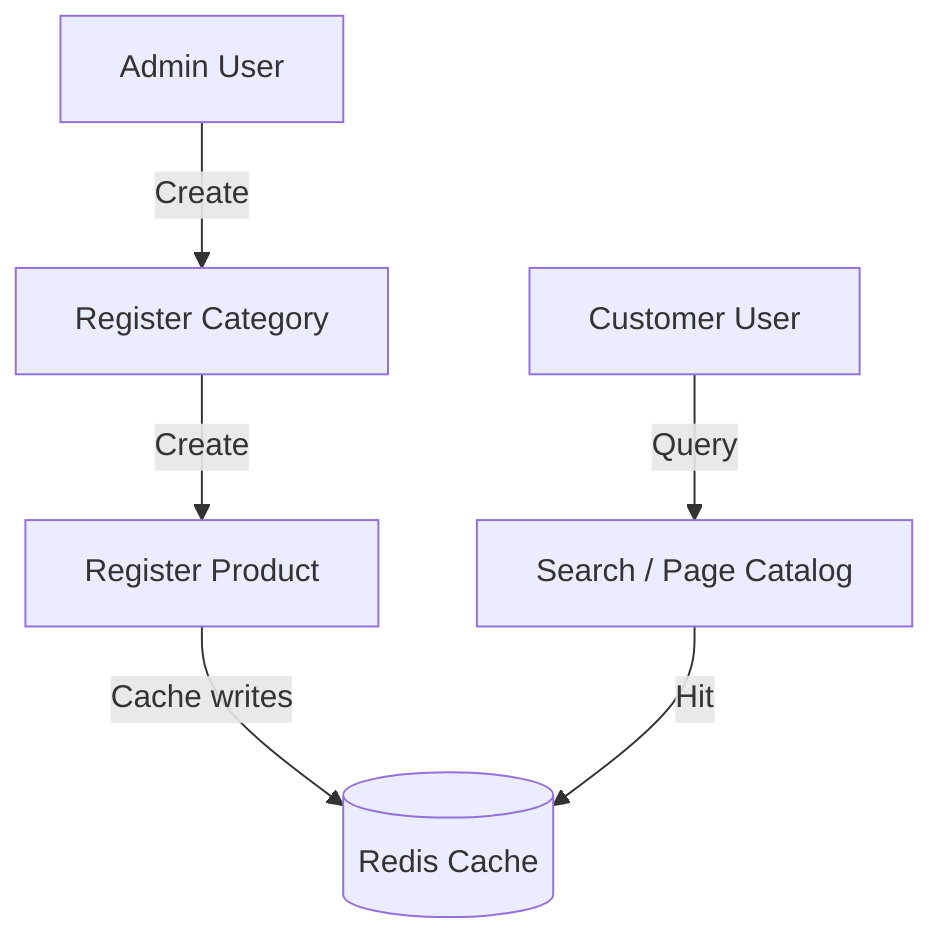

# PRODUCT CATALOG MANAGEMENT MODULE

## 1. Module Overview
* **Purpose**: Manages categories and the product catalog.
* **Business Objective**: Provide fast, searchable catalog listings for customers and inventory management tools for merchants.
* **Responsibilities**: Handles category creation, product additions, stock checks, and catalog search queries.

## 2. Business Flow

## 3. Internal Architecture
* **Controller**: `ProductController.java`, `CategoryController.java`
* **Service**: `ProductServiceImpl.java`, `CategoryServiceImpl.java`
* **Repository**: `ProductRepository.java`, `CategoryRepository.java`
* **Entities**: `Product.java`, `Category.java`

## 4. Important Components
* **ProductRepository**: Custom queries support paginated category listings, out-of-stock filters, and price sorting.
* **RedisCacheConfig**: Caches product catalog pages and evicts keys on modification to maintain consistency.

## 5. Security & Validation
* **Security**: Restricts creation, modification, and deletion endpoints to `ROLE_ADMIN` and `ROLE_SUPER_ADMIN`.
* **Validation**: Rejects negative pricing, negative stock quantities, and duplicate names.
* **Optimistic Locking**: Utilizes `@Version` annotations on products to manage concurrent stock updates during checkout.
