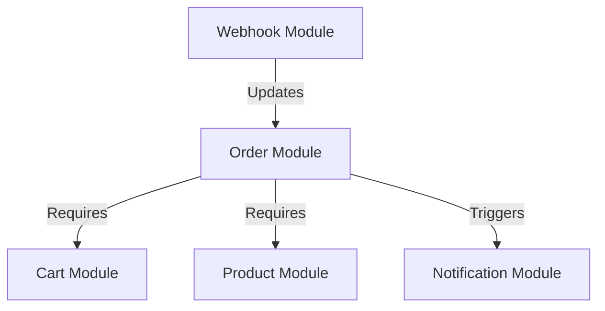

# BUSINESS MODULES REFERENCE MANUAL

Welcome to the internal business feature manual. This directory covers the functional details of the platform's core modules.

## Document Directory

1. **[Authentication & Identity](file:///D:/Meharban_Code/ecommerce/docs/02_MODULE_DOCUMENTATION/AUTHENTICATION.md)**
   * Details user registration, login mechanisms, and refresh token cycles.
2. **[Product Catalog Management](file:///D:/Meharban_Code/ecommerce/docs/02_MODULE_DOCUMENTATION/PRODUCT.md)**
   * Describes categories, catalog listings, and optimistic locking controls.
3. **[Shopping Cart Subsystem](file:///D:/Meharban_Code/ecommerce/docs/02_MODULE_DOCUMENTATION/CART.md)**
   * Details cart operations and shopping session validations.
4. **[Checkout & Order Processing](file:///D:/Meharban_Code/ecommerce/docs/02_MODULE_DOCUMENTATION/ORDER.md)**
   * Describes order placement, stock verification, and transactional rollbacks.
5. **[Transactional Notification System](file:///D:/Meharban_Code/ecommerce/docs/02_MODULE_DOCUMENTATION/NOTIFICATION.md)**
   * Details the outbox pattern, background schedulers, and retry behaviors.
6. **[Webhook Processing Subsystem](file:///D:/Meharban_Code/ecommerce/docs/02_MODULE_DOCUMENTATION/WEBHOOK.md)**
   * Integrations, signature verifications, and idempotency tracking.

## Module Dependency Tree

