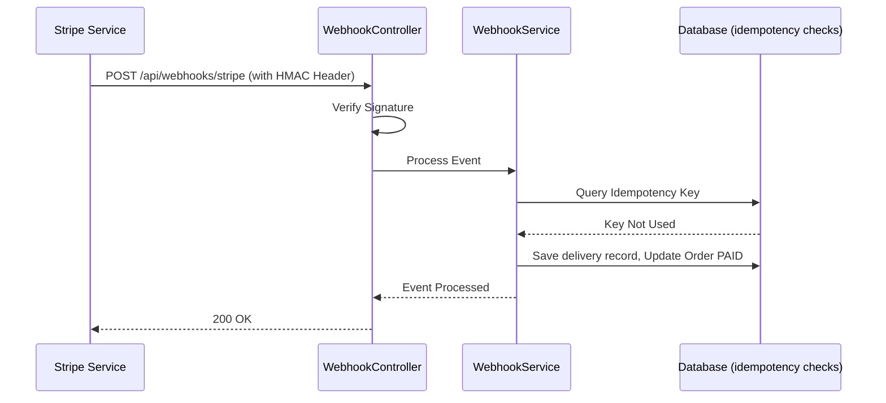

# WEBHOOK PROCESSING SUBSYSTEM

## 1. Module Overview
* **Purpose**: Manages incoming payment gateway events (e.g., Stripe).
* **Business Objective**: Process asynchronous payment confirmations to update order statuses.
* **Responsibilities**: Validates signature headers, enforces idempotency, and updates order states.

## 2. Business Flow

## 3. Internal Architecture
* **Controller**: `WebhookController.java`
* **Service**: `WebhookServiceImpl.java`
* **Repository**: `WebhookDeliveryRepository.java`
* **Entities**: `WebhookDelivery.java`

## 4. Important Components
* **WebhookServiceImpl**: Verifies signature headers and logs event details in `webhook_deliveries` to enforce idempotency constraints.

## 5. Security & Validation
* **Signature Verification**: Validates HMAC signature headers using secrets to confirm request authenticity.
* **Idempotency**: Webhook events are logged in the database using their unique IDs to prevent duplicate processing.
