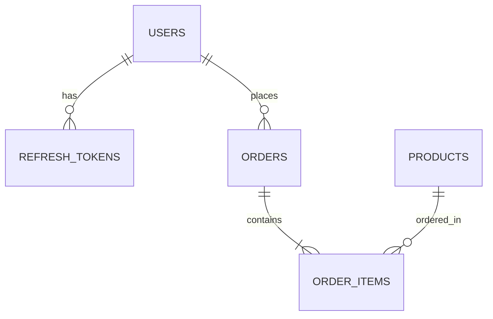

# 04. Database Documentation

## 1. Entity Relationships Diagram

## 2. Integrity & Lock controls
* **Optimistic Locking**: Write-heavy product stocks use `@Version` annotations.
* **Unique Indexes**: unique index exists on `users.email` and `refresh_tokens.token`.
