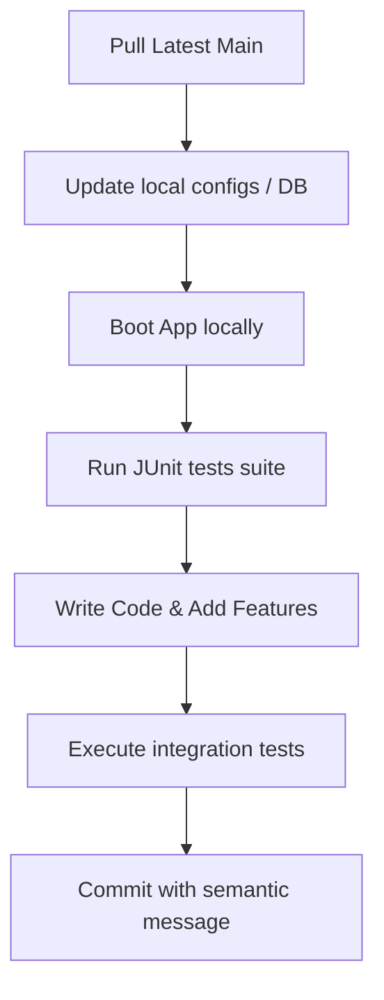

# DEVELOPMENT LIFECYCLE WORKFLOW

This document outlines the daily development workflow and verification steps for code changes.

## 1. Feature Lifecycle Workflow



## 2. Commit Standards
Write clear, concise commit messages. Prefix your commit messages with semantic tags to describe the change (e.g., `feat:`, `fix:`, `docs:`, `test:`).

## 3. Verification Command Checklist
Run the Maven test task to verify compilation and test execution:
```bash
mvn clean compile test
```
All tests must pass successfully before proposing a pull request.
