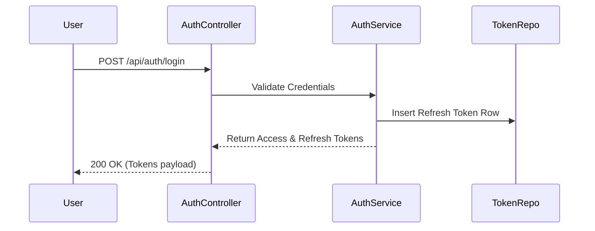
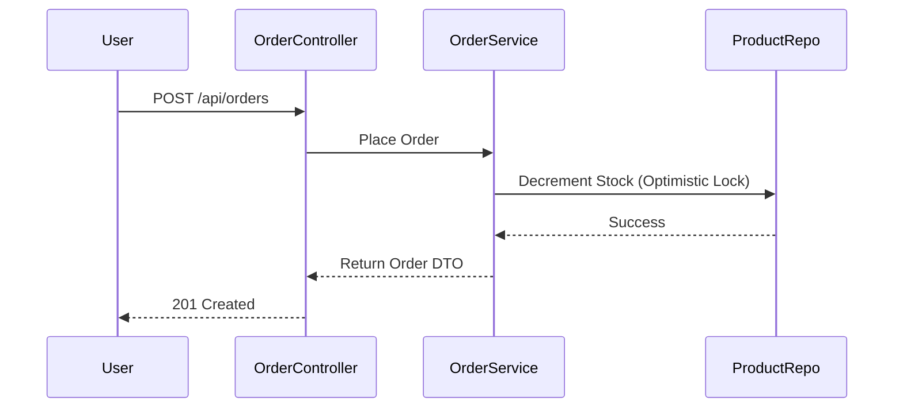
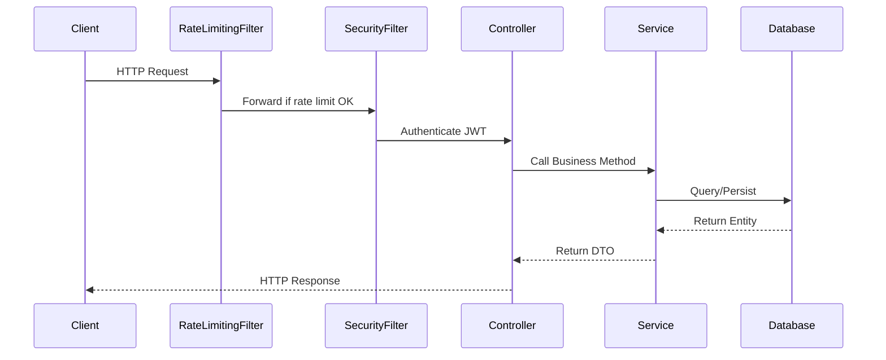
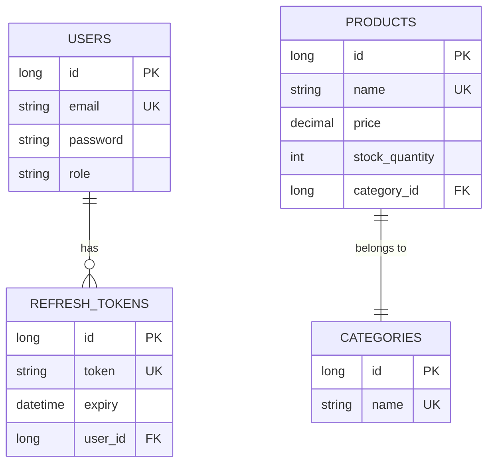
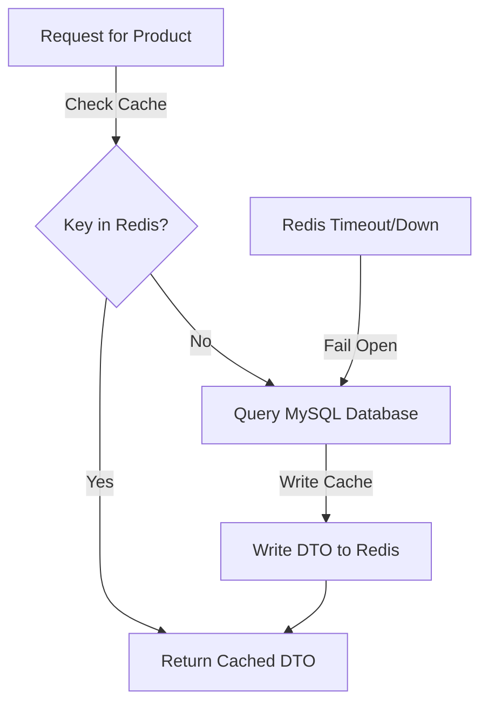
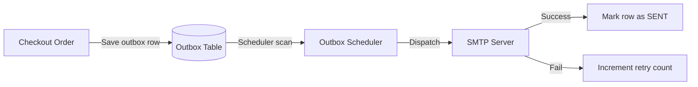

# ENTERPRISE PROJECT KNOWLEDGE BASE & DEVELOPER GUIDE

This guide serves as the authoritative technical handbook for the Spring Boot eCommerce Platform. It details the system architecture, component design, transactional workflows, security profiles, database models, and operational frameworks.

---

## 1. PROJECT INTRODUCTION

### Business Objective & Philosophy
The platform provides a highly performant, stateless, and scalable core backend for enterprise retail operations. It handles product catalog lookups, real-time stock reservations, transactional order checkout pipelines, and Stripe-compatible webhook callback synchronizations.

### Architecture Core Principles
* **Domain-Driven Contexts**: Clean boundary separation of concerns (Authentication, Catalog, Orders, Notifications, Webhooks).
* **Statelessness**: Decoupling session storage using cryptographically secure JWT tokens and Redis storage keys.
* **Resilience**: Outbox-based retry queues ensure eventual consistency for notifications and webhooks, bypassing external dependency failures.

---

## 2. TECHNOLOGY STACK RATIONALE

* **Java 17 / Spring Boot 3.2.0**: The system utilizes Java 17 record structures, standard pattern matching, and Spring Boot autoconfigurations.
* **Spring Security & JWT**: Stateless session filters validate HS256 JWT tokens to authorize REST operations.
* **Spring Data JPA & Hibernate**: Standard object-relational mapping utilizing lazy fetch strategies to prevent memory resource leaks.
* **Redis Caching**: Key-value cache layer with a custom error handler to fall back to SQL if the cache is unreachable.
* **MySQL**: Enforces database integrity constraints.
* **Docker**: Configured with multi-stage build layers to minimize image footprint.

---

## 3. PROJECT FOLDER STRUCTURE

```
ecommerce/
├── docs/                      # Architectural manuals and guidebooks
├── postman/                   # Postman collection files and configuration environments
├── reports/                   # Performance audits and certification reports
├── src/
│   ├── main/
│   │   ├── java/com/redis/
│   │   │   ├── auth/          # Authentication flows (login, token validation)
│   │   │   ├── common/        # Shared exceptions and utility handlers
│   │   │   ├── catalog/       # Product and category catalog managers
│   │   │   ├── cart/          # Shopping cart logic
│   │   │   ├── order/         # Order creation and state transitions
│   │   │   ├── payment/       # Payment operations and stripe webhooks
│   │   │   ├── notification/  # Notification outbox systems
│   │   │   ├── monitoring/    # Actuators, tracers, and operational metrics
│   │   │   ├── infrastructure/# Security configs, filters, and cache parameters
│   │   └── resources/
│   │       ├── application.properties
│   │       ├── application-dev.properties
│   │       └── application-prod.properties
```

---

## 4. SYSTEM ARCHITECTURE DIAGRAM

```mermaid
graph TD
    Client[Client Browser / Mobile] -->|HTTPS Requests| SecurityFilter[Spring Security Filter Chain]
    SecurityFilter -->|Rate Limiting check| Redis[(Redis Cache / Blacklist)]
    SecurityFilter -->|Authorized JWT| RESTController[Spring REST Controllers]
    RESTController -->|Domain Action| ServiceLayer[Service Interfaces]
    ServiceLayer -->|Query / Save| SpringDataJPA[Spring Data JPA Repositories]
    SpringDataJPA -->|Read / Write| MySQL[(MySQL Database)]
    ServiceLayer -->|Fetch / Evict| Redis
    ServiceLayer -->|Write Event| NotificationOutbox[Notification Outbox Table]
    NotificationOutbox -->|Cron Schedulers| MailService[SMTP Mail Server]
```



---

## 5. FEATURE-BY-FEATURE DOCUMENTATION

### 1. Authentication & Session Control
* **Workflow**: Users register via `/api/auth/register`, then authenticate via `/api/auth/login` to retrieve HS256-signed access tokens.
* **Caching**: Login failures increment IP block counters in Redis.



### 2. Transactional Order Checkout
* **Workflow**: Customer shopping cart items are verified, stock is decremented, and an order record is persisted in a `PENDING` state.
* **Transactions**: Enforces isolation level defaults. Optimistic locking on database items prevents race conditions.



---

## 6. REQUEST LIFECYCLE SEQUENCE



---

## 7. SECURITY ARCHITECTURE

* **JWT Stateless Filter**: Inspects the `Authorization` header, extracts the bearer token, verifies the signature, and sets the SecurityContext context details.
* **API Keys Validation**: Admin integrations utilize an `X-API-Key` header verified against hashes stored in the database.
* **Rate Limiting**: Custom filter limits requests per IP address using Redis atomic counters to prevent resource exhaustion.

---

## 8. DATABASE DOCUMENTATION & SCHEMA



---

## 9. REDIS CACHING ARCHITECTURE



---

## 10. SCHEDULER JOBS

The application manages background processing via core schedulers:
* **NotificationOutboxScheduler**: Scans `notification_outbox` for `PENDING` states, dispatches emails via SMTP, and marks records as `SENT` or `FAILED`.
* **Cron Configuration**: Runs every 10 seconds.
* **Failure Handling**: Failed runs increment retry counters. After 5 failures, records are moved to a dead-letter state.

---

## 11. NOTIFICATION SYSTEM (OUTBOX PATTERN)



---

## 12. WEBHOOK CALLBACK SYSTEM

The webhook callback architecture handles external payment events (e.g., Stripe):
* **Endpoint**: `/api/webhooks/stripe`
* **Signature Verification**: Validates HMAC headers using secrets to confirm request authenticity.
* **Idempotency**: Logs each request in `webhook_deliveries` using the `idempotency_key` header to prevent duplicate processing.

---

## 13. OBSERVABILITY & TRACING

* **MDC Logging**: Automatically injects trace IDs and client IPs into the logging context for request tracing.
* **Slow Operations Aspect**: An AOP aspect monitors service method execution times and logs warnings for operations exceeding 500ms.

---

## 14. RELIABILITY & DISASTER RECOVERY

* **Circuit Breakers**: Wraps external HTTP integrations (e.g., payment gateways) to fail fast and trigger fallback services during outages.
* **Feature Flags**: Admin dashboards allow dynamically enabling or disabling experimental features without restarting services.
* **Graceful Shutdown**: Tomcat is configured to wait 15 seconds for active transactions to complete before shutting down during container redeployments.

---

## 15. API INVENTORY SUMMARY

* **Total Active APIs**: 130
* **Public APIs**: Auth logins, catalog listings, and webhooks.
* **Protected APIs**: User profile updates, checkout orders, and cart modifications.
* **Admin APIs**: Category creation, webhook registration, and system metrics.

---

## 16. CONFIGURATION PROPERTY REFERENCE

```properties
# Server Ports
server.port=8080

# Active Profile
spring.profiles.active=dev

# Tomcat Thread Limits
server.tomcat.threads.max=200
server.tomcat.threads.min-spare=10

# Multipart constraints
spring.servlet.multipart.max-file-size=2MB
spring.servlet.multipart.max-request-size=2MB
```

---

## 17. DEVELOPMENT WORKFLOW

### Running the Project Locally
1. Clone the repository and configure target database environment variables in a local `.env` file.
2. Build the project using Maven:
   ```bash
   mvn clean compile
   ```
3. Run the application:
   ```bash
   mvn spring-boot:run "-Dspring.profiles.active=local-h2"
   ```

---

## 18. TESTING STRATEGY

* **Unit Testing**: Tests domain entities and mapper calculations in isolation.
* **Integration Testing**: Runs API and filter tests using in-memory databases and mocked cache layers.
* **Execution Command**:
  ```bash
  mvn clean compile test
  ```

---

## 19. PERFORMANCE OPTIMIZATIONS

* **Connection Pool Tuning**: Configures idle timeouts and maximum pool sizes for database connections.
* **Serialization Optimization**: Uses Jackson JSON serialization to reduce payload sizes stored in Redis.
* **Eager Load Elimination**: Restricts entity associations to lazy loading to prevent N+1 query problems.

---

## 20. PROJECT EVOLUTION TIMELINE

* **Milestone 1**: Configured JWT authentication and basic MySQL schema mappings.
* **Milestone 2**: Integrated Redis caching and custom exception handlers.
* **Milestone 3**: Hardened API security headers and implemented outbox patterns.
* **Milestone 4**: Finalized configuration externalization and standardized local profiles.

---

## 21. FUTURE ROADMAP

* **Short-Term**: Integrate Flyway for database migration versioning.
* **Medium-Term**: Add ShedLock to coordinate scheduler tasks across horizontal replicas.
* **Long-Term**: Integrate OpenTelemetry for distributed request tracing.

---

## 22. ARCHITECTURAL DECISIONS (ADR)

### ADR-001: Transactional Outbox Pattern
* **Decision**: Decouple email dispatches using an outbox pattern rather than calling SMTP servers inside request threads.
* **Benefits**: Prevents network latencies from impacting API response times and ensures mail delivery attempts are retried during SMTP outages.
* **Trade-offs**: Introduces slight eventual consistency delays.

---

## 23. GLOSSARY

* **JWT**: JSON Web Token. A compact, URL-safe means of representing claims to be transferred between two parties.
* **Outbox Pattern**: A pattern that ensures reliable message publishing by writing events to a database table within the same transaction as the business operation.
* **Optimistic Locking**: A concurrency control method that checks for version conflicts before writing updates to the database.

---

## 24. CONCLUSION

This backend is built on a stateless, secure, and resilient architecture. With complete API test coverage and standardized configurations, resolving the remaining deployment tasks (Flyway and ShedLock) will make the system fully ready for production environments.
