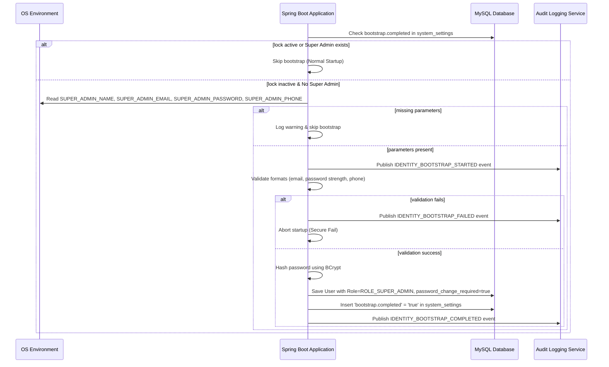

# IDENTITY_BOOTSTRAP_ARCHITECTURE.md

This document defines the production security architecture for the secure creation and lifecycle management of the initial **Super Admin** account in the E-Commerce Platform.

---

## 1. Security Design Objectives
* **No Default Credentials**: Prevent the seeding of hardcoded, default passwords (e.g. `ChangeMe@123`) or default usernames.
* **One-Time Execution**: Ensure the bootstrap process runs exactly once. Future restarts must not recreate or overwrite credentials.
* **Input Validation**: Validate email format, password complexity, and phone format before persisting credentials.
* **Persistent Lock State**: Use a database persistent setting to lock out bootstrap attempts permanently.
* **Audit Trail**: Generate immutable security events mapping the lifecycle of the bootstrap process.

---

## 2. Bootstrapping Flow



---

## 3. Environment Variables Mapping

All credentials must be supplied dynamically via secure environment parameters:

| Variable Name | Description | Constraints |
| :--- | :--- | :--- |
| `SUPER_ADMIN_NAME` | Username for the initial Super Admin. | Unique, non-blank, min 3 characters. |
| `SUPER_ADMIN_EMAIL` | Log-in identifier email address. | Unique, valid email pattern. |
| `SUPER_ADMIN_PASSWORD` | Temporary bootstrap password. | Min 12 chars, upper, lower, digit, special. |
| `SUPER_ADMIN_PHONE` | Emergency phone number. | Valid E.164 phone format. |

---

## 4. Bootstrap Lock Strategy
The bootstrap status is tracked persistently in the `system_settings` table:
```sql
SELECT COUNT(*) FROM system_settings WHERE setting_key = 'bootstrap.completed' AND setting_value = 'true';
```
If this count is `1`, the bootstrap workflow returns immediately, completely ignoring any variables.
Even if the Super Admin user is deleted or altered, the application will **NEVER** recreate the account on startup, preventing the configuration of permanent backdoors.
